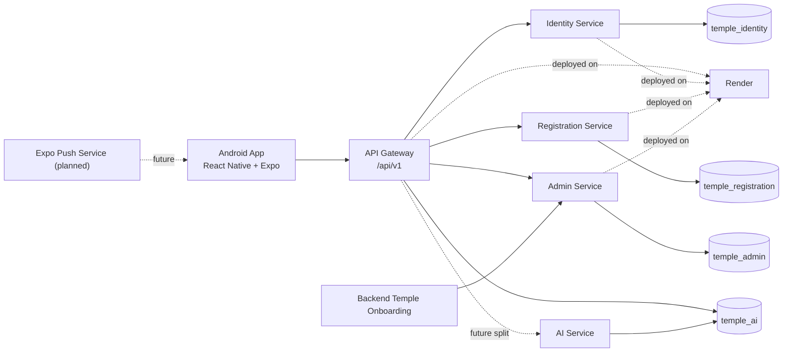
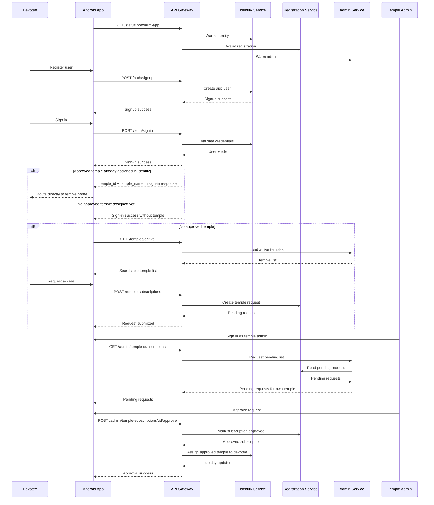
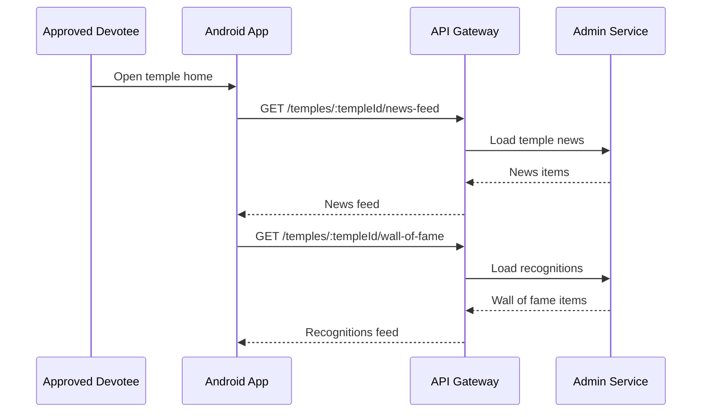
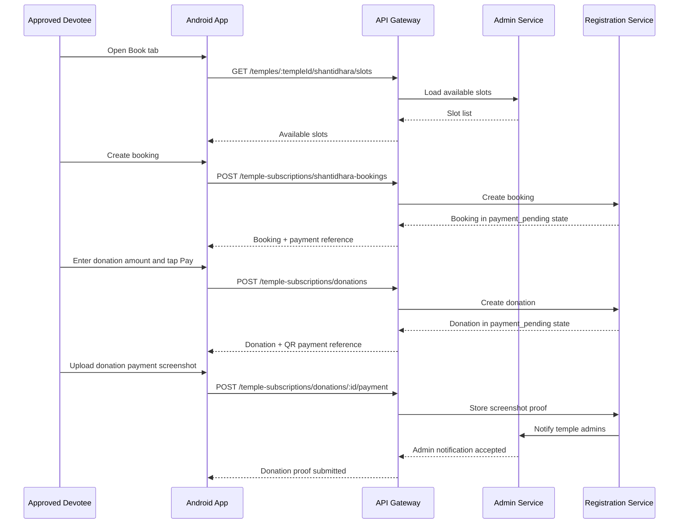
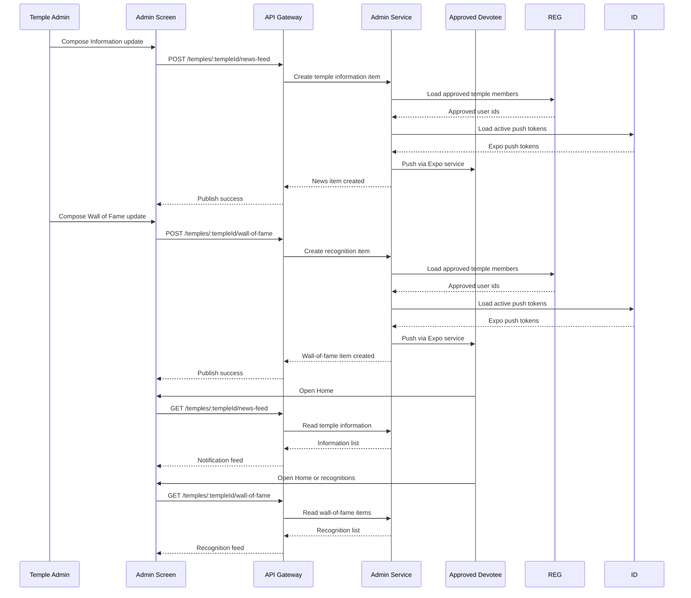

# Temple App Phase 1 - MVP Architecture

Created: 2026-04-28  
Last Updated: 2026-05-08

## 1. MVP Runtime Path

The primary accepted runtime path for Phase 1 MVP is:

- Android app
- Render-hosted APIs
- service-owned databases
- Render cold-start-aware API gateway

Local backend services are not part of the MVP acceptance path.

## 2. Locked MVP Product Direction

Phase 1 MVP is intentionally narrow:

- temples are onboarded from backend systems
- temple admins are provisioned from backend temple onboarding
- users register at app level directly
- users sign in with contact number and password
- users without approved temple access see `Add Temple`
- users search temples and request access
- temple admins approve or reject requests
- admin approval updates the devotee identity profile with the approved temple for faster next sign-in
- approved users land directly on temple home
- temple admin now also lands on the shared temple home shell with an extra `Admin` tab
- temple home uses an image carousel for visual context while detailed temple timings move into a separate `More information` sheet
- temple home also exposes shortcut utility actions for notifications, streaming, events, activity, donation, and app sharing
- temple home now includes a left-side `My Profile` panel plus clickable announcement detail cards with progressive `See more` loading
- current reviewed UI direction uses a white base, Jain-flag yellow as the main accent, and red only for sacred emphasis
- temple gallery image URLs and timing/detail content are now part of temple-admin-owned temple metadata
- temple gallery upload is handled through the temple-admin service and served back through the gateway as temple metadata
- Shantidhara booking is constrained to next-30-days, two 8:00 AM slots per day from admin-owned slot data
- booking and donation move through QR payment plus screenshot submission before admin review
- temple chat tab is now upgraded to a service-backed temple assistant shell named `Aagam Mitra`
- users can log out

Deferred after MVP:

- final real-device push notification validation
- payment integration
- full chat implementation
- extra theme refinement after current accepted direction

## 3. Core Service Ownership

### `temple-identity-service`

Owns:

- user registration
- user sign-in
- password verification
- user role lookup
- approved devotee primary temple assignment used by the sign-in response
- Expo push token storage

### `temple-registration-service`

Owns:

- temple access request creation
- duplicate request prevention
- devotee subscription status lookup
- booking and donation pending records
- payment screenshot submissions for booking and donation
- member activity aggregation
- approved temple member lookup for notification delivery

### `temple-admin-service`

Owns:

- temple records created from backend
- executive committee or trustee records
- temple admin bootstrap
- active temple list
- pending temple request review
- approve or reject request
- temple information updates
- temple wall-of-fame updates
- Shantidhara slot inventory and reservation
- temple payment QR profile
- push notification fanout to approved temple members
- push notification fanout to temple admins for payment-proof submission

### `temple-ai-service`

Owns:

- temple-scoped assistant orchestration
- persisted temple knowledge ingestion
- chunking and embeddings storage
- embeddings-backed retrieval with local fallback
- tool-backed live temple status lookups
- OpenAI-backed final answer generation when configured
- action-card responses for booking, donation, home, and admin flows

Current deployment note:

- the same assistant runtime is temporarily hosted inside `temple-api-gateway`
- this keeps Chat live while the dedicated AI repo and Render service are being provisioned

### `temple-api-gateway`

Owns:

- single mobile-facing `/api/v1` contract
- routing to downstream services
- centralized CORS handling
- cold-start-tolerant upstream timeouts for Render
- prewarm endpoints for auth and temple-access flows

## 4. Current Data Boundary

### `temple_identity`

- `users`
- `user_push_tokens`

### `temple_registration`

- `temple_subscriptions`
- `shantidhara_bookings`
- `donation_orders`
- `payment_transactions`

### `temple_admin`

- `temples`
- `temple_admins`
- `leadership_members`
- `temple_news_feed_items`
- `temple_wall_of_fame_items`
- `shantidhara_slots`

### `temple_ai`

Current now:

- `temple_knowledge_documents`
- `temple_knowledge_chunks`
- `temple_knowledge_sync_state`

Planned later:

- chat_sessions
- chat_messages
- retrieval_logs
- tool_audit_logs

## 5. Required MVP APIs

- `POST /api/v1/auth/signup`
- `POST /api/v1/auth/signin`
- `GET /api/v1/temples/active`
- `GET /api/v1/temple-subscriptions/me`
- `POST /api/v1/temple-subscriptions`
- `GET /api/v1/admin/temple-subscriptions`
- `POST /api/v1/admin/temple-subscriptions/:id/approve`
- `POST /api/v1/admin/temple-subscriptions/:id/reject`
- `POST /api/v1/temples/:templeId/news-feed`
- `POST /api/v1/temples/:templeId/wall-of-fame`
- `POST /api/v1/auth/push-tokens/register`

## 6. Mobile Behavior to Lock

### Public flow

- Landing page shows only:
  - `Register User`
  - `Existing User? Sign in`

### Devotee flow

- registration creates app account immediately
- sign-in checks user identity
- approved temple exists -> route directly to temple home
- no approved temple -> route to searchable `Add Temple`
- logout returns user to landing page

### Temple admin flow

- admin sign-in opens pending temple request review
- admin sees only requests for own temple
- admin can approve or reject request
- admin can publish `Information` updates
- admin can publish `Wall of Fame` updates

## 7. MVP Architecture Diagram

## 8. MVP Communication Flow

## 9. Final MVP Recommendation

Do not expand scope again until the Android + Render path is stable for:

- register
- sign in
- search temples
- add temple request
- admin approval
- direct approved-user temple home
- logout

## 10. MVP1 Architecture

`MVP1` is the first post-MVP release and stays narrow:

- keep the same Android + Render runtime path
- enrich only the approved devotee temple home
- use existing safe content APIs:
  - `GET /api/v1/temples/:templeId/news-feed`
  - `GET /api/v1/temples/:templeId/wall-of-fame`
- avoid reintroducing booking, donation, and payment actions until those flows are complete

### MVP1 communication add-on

## 11. MVP2 Architecture

`MVP2` builds on top of MVP1 and introduces:

- Shantidhara slots
- Shantidhara booking creation
- donation amount entry and QR payment initiation
- payment-pending confirmation flow

### MVP2 communication add-on

## 12. MVP3 Architecture

`MVP3` is focused on current polish and temple communication:

- reviewed white-base UI direction
- login-first auth flow
- minimal no-temple discovery flow
- admin notification publishing
- push delivery plumbing implemented
- final device validation still pending

### MVP3 communication add-on

## 13. Push Notification Recommendation

Current mobile push service choice:

- `Expo Push Notifications`

Reason:

- frontend already uses Expo
- easiest cross-platform mobile path
- Expo can relay to:
  - `FCM` for Android
  - `APNs` for iPhone

Implemented push sequence:

1. App registers device and receives Expo push token.
2. Backend stores push token against approved user device.
3. Temple admin publishes `Information` or `Wall of Fame`.
4. Backend fans out push notification to approved temple members.

Acceptance note:

- push delivery still needs a real-device verification pass before it can be marked complete

## 14. AI Foundation

Current AI slice:

- dedicated `temple-ai-service`
- `POST /api/v1/temples/:templeId/assistant/chat` through the gateway
- persisted temple knowledge sync from admin-owned temple content
- chunking and embeddings-backed retrieval
- live temple tools for membership, booking, donation, payment profile, and latest notifications
- frontend Chat tab now calls the assistant route and renders action cards
- deployed assistant runtime currently executes inside the gateway for immediate availability

Planned next:

- deploy `temple-ai-service` on Render as the separated runtime
- switch production AI storage to Postgres
- add chat session persistence
- add admin drafting tools
